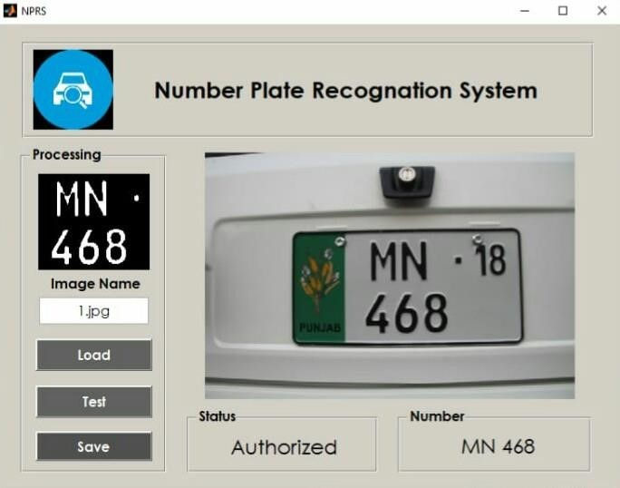
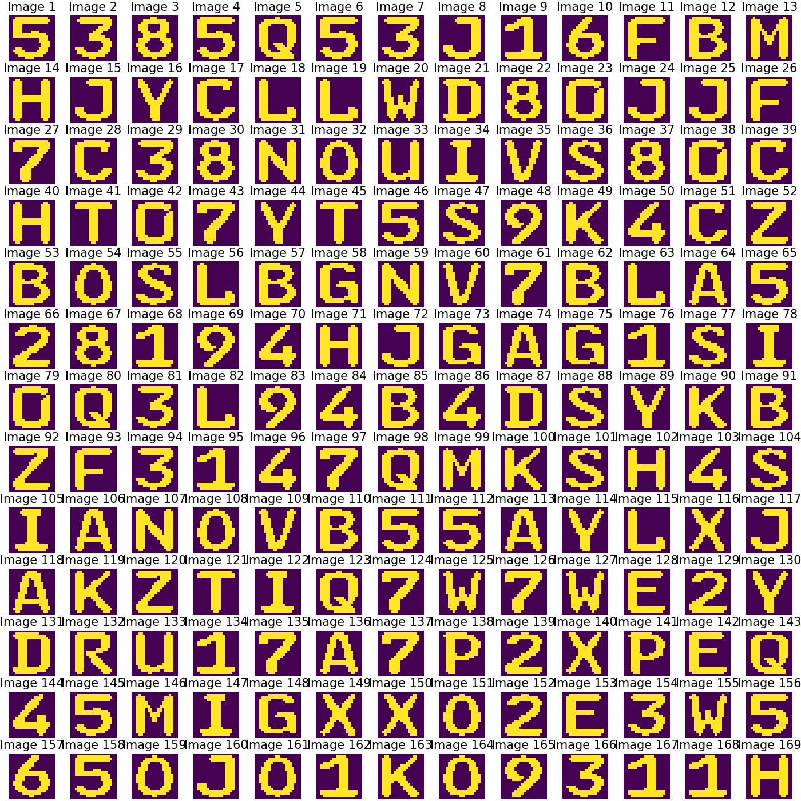

# Number Plate Recognition System Using ANN (Machine Learning)
NPRS is Machine Learning based number plate recognition system with a trained (Feed-Forward) neural network that is capable recognize only Punjab (Pakistan) number plates.
- Tested on MATLAB R2014a

# Setting up
- Download zip file  
- Extract it in Matlab folder 
- Add this to path 
- Run NPRS.m 
- Put number plate image directory in text box 

# GUI display

  

# Dataset display

  

# Dataset Metadata
## Title: Alphanumeric Character Recognition Dataset
# Description:
This dataset contains images of alphanumeric characters (0-9 and a-z) for text recognition tasks. Each character is represented by 100 samples, resulting in a total of 3600 samples. The images are grayscale with a resolution of 20x20 pixels, which have been flattened into 400-dimensional vectors.

# Content:
**X:** The feature matrix with dimensions (3600, 400). Each row corresponds to a 20x20 pixel image flattened into a 400-dimensional vector.

**y:** The label matrix with dimensions (3600, 36). Labels are one-hot encoded for 36 classes (0-9 and a-z), where each class has 100 samples.

# Features:
**X (3600, 400):**
Each row represents a flattened 20x20 pixel grayscale image of an alphanumeric character.
Contains 3600 samples, with each sample having 400 features.

**y (3600, 36):**
Each row represents the one-hot encoded label for the corresponding sample in X.
Contains 3600 samples, with each sample having 36 features representing the alphanumeric classes (0-9 and a-z).

# Classes:
**36 classes** representing the alphanumeric characters:

**Digits:** 0, 1, 2, 3, 4, 5, 6, 7, 8, 9

**Letters:** a, b, c, d, e, f, g, h, i, j, k, l, m, n, o, p, q, r, s, t, u, v, w, x, y, z

# Usage:
This Dataset is primarily made for **"Pakistan (Punjab) Number Plates Recognition specifically for German-style number plate font "** but it is not limited, it is suitable for tasks such as:

- Alphanumeric character recognition
- Optical character recognition (OCR)
- Machine learning and deep learning experiments for text classification

# Source:
This dataset was created for research and educational purposes to facilitate the development and evaluation of text recognition algorithms.

# Acknowledgements:
If you use this dataset in your research or projects, please cite the source appropriately.

# NOTE
Simply load csv files mentioned below for loading data in dataframes
- **X_NPRS_dataset_samples.csv**
- **y_NPRS_dataset_labels.csv**

or load **AlphaNumaric.mat** for loading data in MATLAB
